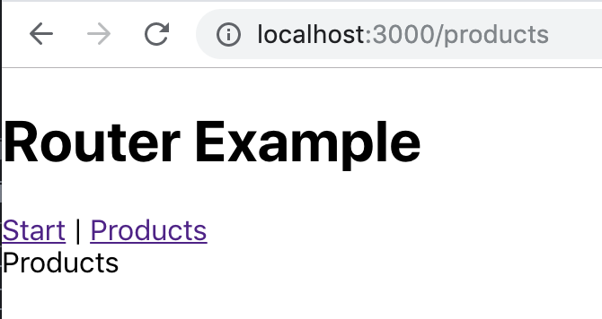

## Instructions for students:

### Create a React App using Router

The user should be able to reach a main route ("/") named start, and also route for products. When the user types the wrong route they should be redirected to a 404 message saying route not found. The user should be able to return to the main route or the products route by clicking on the corresponding link.

-   Start the project with create react app.

-   Use react-router and switch

-   Here is an image for reference:
    

**Bonuses**

-   add other routes to your App

### Rules

-   This is an individual assignment.
-   Deadline: 30 min.
-   Use **Git properly**
-   Feel free to document your code with comments.
